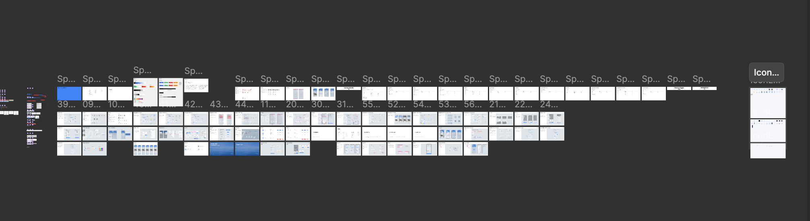

# 宝思派小程序 UI 设计规范

AI重构原设计规范

## 一、色彩规范

### 1\. 品牌色 Brand Palette

|Token|色值|用途|
|---|---|---|
|color/brand/1|\#E5F0FF|最浅|
|color/brand/2|\#CCE1FF|—|
|color/brand/3|\#A9CCFF|—|
|color/brand/4|\#80B4FF|—|
|color/brand/5|\#62A2FF|—|
|color/brand/6|\#2C82FF|默认/主色 Default|
|color/brand/7|\#2875E6|按下 Pressed|

### 2\. 中性色 Neutral

|Token|色值|Token|色值|
|---|---|---|---|
|color/neutral/white|\#FFFFFF|color/neutral/black|\#000000|
|color/neutral/050|\#F2F2F2|color/neutral/100|\#E6E6E6|
|color/neutral/black\-90|\#000000 90%|color/neutral/black\-55|\#000000 55%|
|color/neutral/black\-35|\#000000 35%|color/neutral/black\-30|\#000000 30%|
|color/neutral/black\-20|\#000000 20%|color/neutral/black\-10|\#000000 10%|
|color/neutral/black\-08|\#000000 8%|color/neutral/black\-05|\#000000 5%|
|color/neutral/white\-100|\#FFFFFF|color/neutral/white\-55|\#FFFFFF 55%|
|color/neutral/white\-35|\#FFFFFF 35%|color/neutral/white\-20|\#FFFFFF 20%|

### 3\. 功能色 Functional Colors

|类别|Background|Default|Light|Pressed|
|---|---|---|---|---|
|成功 Success|\#E6F7EE|\#20BE6C|\#C9EFDC|\#1DAB61|
|警告 Warning|\#FFFAF4|\#F19915|\#FCE7C7|\#D98A13|
|危险 Danger|\#FEECEC|\#F12A2A|\#F77F7F|\#F23F3F|

### 4\. 辅助色 \& 安全等级色

|类别|Token|色值|
|---|---|---|
|辅助\-紫|color/auxiliary/purple|\#994DEB|
|辅助\-粉|color/auxiliary/pink|\#E339B3|
|辅助\-绿|color/auxiliary/green|\#9BCE42|
|辅助\-蓝|color/auxiliary/blue|\#4ACFE0|
|辅助\-黄|color/auxiliary/yellow|\#F6C044|
|安全\-优秀|color/safety/excellent|\#20BE6C|
|安全\-良好|color/safety/good|\#F6C044|
|安全\-中等|color/safety/medium|\#FF8600|
|安全\-较差|color/safety/poor|\#E04242|
|安全\-很差|color/safety/bad|\#9859B9|
|安全\-极差|color/safety/critical|\#8A2C46|

### 5\. 语义色映射 Semantic Colors

|分类|语义 Token|→ Primitive|
|---|---|---|
|背景|color/background/page|color/neutral/050|
|背景|color/background/surface|color/neutral/white|
|背景|color/background/subtle|color/neutral/100|
|背景|color/background/muted|color/neutral/black\-08|
|背景|color/background/overlay|color/neutral/black\-30|
|操作|color/action/primary/default|color/brand/6|
|操作|color/action/primary/pressed|color/brand/7|
|操作|color/action/primary/light|color/brand/3|
|操作|color/action/danger/default|color/danger/default|
|操作|color/action/disabled|color/neutral/black\-08|
|文字|color/text/primary|color/neutral/black\-90|
|文字|color/text/secondary|color/neutral/black\-55|
|文字|color/text/tertiary|color/neutral/black\-35|
|文字|color/text/on\-primary|color/neutral/white|
|边框|color/border/default|color/neutral/black\-10|
|边框|color/border/subtle|color/neutral/black\-08|
|状态|color/status/success|color/success/default|
|状态|color/status/warning|color/warning/default|
|状态|color/status/danger|color/danger/default|
|状态|color/status/info|color/brand/6|

## 二、字体规范 Typography

### 1\. 字体方案

|平台|中文字体|英文/数字字体|行高|
|---|---|---|---|
|iOS|苹方 PingFang SC|San Francisco|1\.5 倍|
|Android|思源黑体 Source Han Sans CN|Roboto|1\.5 倍|

### 2\. 字阶 Type Scale

|Token|字号 \(pt\)|行高 \(pt\)|字重|用途|
|---|---|---|---|---|
|T1|36|54|Regular / Bold|顶部导航栏、对话框标题|
|T2|32|48|Regular / Bold|顶部导航栏、对话框标题|
|T3|28|42|Regular / Bold|一级常用文字、单元格内容、大篇幅正文|
|T4|24|36|Regular / Bold|二级辅助文字、单元格内容、大篇幅正文|
|T5|20|30|Regular / Bold|三级辅助文字、说明、标签|

### 3\.目标字体（最终交付）

- 中文：PingFang SC（iOS）/ 思源黑体（Android）

- 英文数字：SF Pro（iOS）/ Roboto（Android）

- 全局行高：1\.5 倍

### 4\.AI 生产替代方案

由于远程环境字体限制，AI 生产时使用以下映射：

|设计稿字重|PingFang SC|AI 替代字体|
|---|---|---|
|Regular \(400\)|不可用|Noto Sans SC Regular|
|Medium \(500\)|✅ 可用|PingFang SC Medium|
|Semibold \(600\)|不可用|Noto Sans SC Bold|
|Bold \(700\)|不可用|Noto Sans SC Bold|

### 5\.后续处理

AI 输出后，设计师在本地 Figma 中全局替换：

Noto Sans SC → PingFang SC（对应字重）

## 三、圆角规范 Radius

|名称|Primitive|Semantic|值|用途|
|---|---|---|---|---|
|小卡片圆角|radius/16|radius/card\-small|16px|较小的卡片|
|卡片圆角|radius/20|radius/card|20px|卡片（单元格组、非通栏卡片）|
|面板圆角|radius/28|radius/large|28px|对话框 / 弹出层|
|大面板圆角|radius/32|radius/panel|32px|操作面板|
|胶囊型|radius/round|radius/control|999px|按钮 / 输入框 / 标签|
|圆型|—|—|50%|圆形组件（电源开关等）|

## 四、图标规范 Icon

### 1\. 设计规范

|项目|规范|
|---|---|
|制作标准|线性单色图标；简单、清晰，减少视觉干扰|
|线条粗细|功能性图标 2px；底部 Tab Bar 图标 1\.6px|
|端点和圆角|线条末端圆角处理，默认圆角 2px|

### 2\. 风格类型

|类型|说明|
|---|---|
|系统图标|线性图标，视觉轻盈干净，有清晰轮廓|
|场景图标|毛玻璃效果，搭配半透明图形|
|设备图标|轻拟物，扁平基础上加入轻微渐变、阴影、高光|

### 3\. 图标分类清单

|分类|数量|尺寸|包含内容|
|---|---|---|---|
|设备多状态|13 组|160×160|窗帘、空调、灯、灯组、智能开关、消毒器、新风、地暖、除湿机、纱窗、升降窗等|
|设备单状态|27 个|160×160（智能锁252×252）|传感器、摄像头、网关、断路器、气象站等|
|操作图标|13 个|24×24|home、connect、firmware\-update、help、about、notification、window\-open/close/tilt/stop、blind\-open/pause/close|
|场景执行动作|3 个|34×34|smart\-device、scene\-trigger、delay|
|状态图标|5 个|20×20|location\-pin、disabled、pause、expand、skip\-prev|
|场景图标|5 个|36×36|default、reading、entertainment、music、movie|
|环境指标|3 个|28×28|tvoc、ammonia、h2s|
|插图|10 个|100×100|no\-device、no\-scene、no\-family、bluetooth、location、nfc\-guide、no\-search、no\-log、no\-message、no\-member|

## 五、布局规范 Layout

|项目|值|
|---|---|
|设计基准|375 × 812 px \(iPhone X 系列\)|
|状态栏高度|44px|
|顶部导航栏高度|44px|
|底部安全区|34px|
|TabBar 高度|49px \+ 34px 安全区 = 83px|
|页面左右边距|16px|
|个人设置页卡片左边距|20pt|

## 六、页面模版

### 配网指引

#### 页面结构总览

|区域|位置|说明|
|---|---|---|
|状态栏|顶部 44px|系统状态栏|
|导航栏|44px|配网指引 标题，左返回箭头，右小程序胶囊|
|设备名称|y=116|加粗标题，水平居中|
|设备图片区域|y=164，347×200|产品照片 \+ 放大镜标注 \+ 手部引导|
|操作说明|y=388 起|请按以下步骤操作 \+ 步骤正文|
|已完成复选框|y=674|已完成上述操作|
|下一步按钮|y=730，347×48|品牌蓝 \#2C82FF 胶囊按钮|

#### 页面背景

|属性|值|
|---|---|
|类型|线性渐变，\#D7DEEa → \#E5E8ED，从上到下|
|装饰层|4 个白色不规则 Vector，opacity 40%|

#### 设备图片区域

|属性|值|
|---|---|
|容器|347×200，圆角 20px，半透明白色渐变背景|
|边框|白色 10% opacity，1px|
|产品照片背景|必须去除背景（仅保留产品实体，透明底）|
|填充模式|CROP 模式|
|产品可见高度|占容器高度的 60%（约 120px）|
|产品位置|容器内 垂直 \+ 水平居中|

#### 放大镜标注规则

|规则|值|
|---|---|
|放大镜圆圈|78×78 椭圆|
|放大倍率|主图的 2 倍|
|焦点对齐|操作重点（如按键、指示灯）必须居中于放大镜圆心|
|手部引导图|展示操作手势的手部照片，可选|
|标注文字|12pt，\#000000 55%|
|指示线|Vector 连线，指向设备对应位置|

#### 文字规范

|元素|字号|字重|颜色|
|---|---|---|---|
|导航标题 配网指引|18pt|Semibold/Bold|black 90%|
|设备名称|20pt|Semibold/Bold|black 90%|
|请按以下步骤操作|14pt|中|black 90%|
|步骤正文|14pt，行高 21px|Regular|black 90%|
|已完成上述操作|14pt|Regular|black 55%|
|下一步 按钮文字|16pt|中|white|

#### 操作说明文字规则

|规则|说明|
|---|---|
|关键词标注|按键类操作词用 加粗（Bold）\+ 引号 标注（如 按键、功能键、复位键\(RST\)）|

#### 下一步按钮

|属性|值|
|---|---|
|尺寸|347×48|
|圆角|55px（全圆胶囊）|
|背景色|\#2C82FF|

#### 制作流程

1. 从已有设备页面克隆模板（推荐万能红外遥控器 13510:36931）

2. 替换标题文字为新设备名称

3. 上传产品实物照片 → 去除背景 → 替换主图

4. 调整主图 CROP：产品可见高度 = 容器 60%，垂直居中

5. 调整放大镜图 CROP：2 倍放大，操作焦点居中于圆心

6. 替换手部引导图（如有）

7. 更新步骤文案，按键类关键词 加粗 \+ 引号

### 首页

#### 首页

首页看板补充Ref nodeId: 13586:42273

场景页Ref nodeId: 38517:15854

首页看板Ref nodeId: 21047:11235

##### 页面基础

|属性|值|
|---|---|
|画布|375 × 812px|
|背景|渐变天空（底部浅蓝→顶部深蓝）\+ 云朵装饰图|

#### 5\-1\.1 已登录首页 \- 看板模式

##### 页面层级（从底到顶）

背景层（渐变\+云朵）→ 导航栏 → 应用Logo → 房间Tab栏 → 编辑按钮 → 设备分类卡片 → 底部Tab Bar

##### 页面组件规格

|组件|项目|规格|
|---|---|---|
|导航栏|尺寸|微信小程序导航栏，375×88px|
|导航栏|说明|包含系统状态栏（时间、信号、电池）|
|应用Logo区域|Logo图标|20×20px，radius 4\.6，白色背景\+渐变色Logo|
|应用Logo区域|应用名|「宝思派智慧家」，PingFang SC Medium 16px，白色|
|房间Tab栏|尺寸|375×44px|
|房间Tab栏|Tab项示例|看板 / 客厅 / 玄关 / 主卧 / 浴室|
|房间Tab栏|选中态|PingFang SC Semibold 20px，白色100%|
|房间Tab栏|未选中态|PingFang SC Regular 20px，白色55%透明度|
|房间Tab栏|选中高亮条|51×34px，蓝色 \#5D99DE，radius 100|
|房间Tab栏|右侧更多按钮|34×34px 圆形，白色20%透明度|
|编辑按钮|尺寸|60×26px，白色背景，radius 100（胶囊型）|
|编辑按钮|文字|「编辑」12px，黑色55%透明度|

##### 设备分类卡片（照明/窗帘等）

|区域|项目|规格|
|---|---|---|
|容器|外层容器|347px宽，radius 8（裁切），左右margin 14px|
|容器|内层背景|347px宽，radius 20，线性渐变填充|
|卡片头部|分类图标|50×50px，左上角\(16,16\)|
|卡片头部|分类名称|PingFang SC Semibold 16px，黑色90%透明度|
|卡片头部|分类描述|PingFang SC Regular 12px，黑色35%透明度|
|卡片头部|展开箭头|16×16px|
|卡片头部|全开/全关按钮|62×36px，radius 100（胶囊型），14px|
|房间设备子卡片|排列方式|水平排列，可滚动，间距8px|
|房间设备子卡片|照明卡片|148×171px，radius 16，2个操作按钮（全开/全关）|
|房间设备子卡片|窗帘卡片|148×223px，radius 16，3个操作按钮（打开/暂停/关闭）|
|房间设备子卡片|房间名|PingFang SC Semibold 14px，黑色90%|
|房间设备子卡片|状态描述|PingFang SC Regular 12px，黑色35%|
|操作按钮|尺寸|132×44px，radius 16|
|操作按钮|内容|图标\(20×20\) \+ 文字\(14px Regular\)|

#### 5\-1\.2 已登录首页 \- 房间设备列表模式

选择具体房间（非"看板"）时显示设备卡片网格。

##### 全宽设备卡片（窗帘等含操作面板）

|项目|规格|
|---|---|
|尺寸|347×140px，radius 20|
|内容|设备图标50×50 \+ 名称\(14px\) \+ 状态\(12px\)|
|操作按钮|3个快捷操作按钮并排\(105×40\)|

##### 半宽设备卡片（灯/传感器等）

|项目|规格|
|---|---|
|尺寸|\~169×140px，radius 20|
|排列|每行2个，间距约9px|
|内容|设备图标50×50 \+ 开关按钮40×40圆形|
|设备名|14px（长名截断加"\.\.\."）|
|位置\|状态|12px（如"客厅 \| 30% 3800K"）|

#### 5\-1\.3 未登录首页（空状态）

与已登录共用：渐变背景、导航栏、应用Logo、底部Tab Bar

##### 差异内容（居中排列）

|项目|规格|
|---|---|
|欢迎标题|「Hi，欢迎回家」20px|
|WiFi/智能设备图标|100×100px|
|说明文字|「登录即可控制智能设备\\n开启智能生活」14px，居中|
|登录按钮|136×40px，radius 19，「立即登录」16px|

##### 场景Tab空状态差异

|项目|规格|
|---|---|
|标题|改为「场景」|
|图标|换为场景插画|
|说明文字|「登录即可解锁场景功能」|

#### 5\-1\.4 底部Tab Bar（全局通用）

|项目|规格|
|---|---|
|总高|375×83px|
|底部安全区|34px，浅灰色 \#F3F5F7|
|Tab按钮区|375×49px|
|Tab数量|3个Tab：首页 / 场景 / 我的|
|每个Tab|宽125px，图标\+文字纵向排列|

### 设备控制页

#### 配网指引页模板

配网流程Ref nodeId: 13266:62030

适用：所有设备的配网流程（传感器、开关、插座、门锁等，共\~15个页面）

**页面结构（375×812px）**

导航栏 → 产品名称 → 产品图片区 → 操作步骤 → 确认勾选 → 下一步按钮

**导航栏**

|项目|规格|
|---|---|
|标题|「配网指引」，居中，18px|
|返回箭头|左侧|
|右侧|更多按钮|

**产品图片区**

|项目|规格|
|---|---|
|容器|347×200px，浅灰色 \#F5F5F5，radius 8，水平居中\(margin 14\)|
|产品实体图|去除背景，CROP模式，可见产品高度=容器高度×60%，居中显示|
|放大镜（可选）|圆形78×78 ELLIPSE遮罩，放大2倍，焦点（如按键）居中|
|标注文字（可选）|指示线\+说明文字标注产品部件|
|手势图（可选）|展示操作手势的参考图|

**产品名称**

|项目|规格|
|---|---|
|字体|Medium 18px，黑色|
|位置|图片区下方|

**操作步骤**

|项目|规格|
|---|---|
|副标题|「请按以下步骤操作」，Regular 14px，灰色60%|
|步骤文字|Regular 14px，黑色80%|
|关键词强调|按键类操作词（按键、开关、复位键等）加粗\(Bold\)\+加引号「」|

**确认勾选**

圆形checkbox 20×20 \+ 「已完成上述操作」Regular 14px

**下一步按钮**

347×44px，radius 22（胶囊型），蓝色渐变背景；「下一步」Medium 16px 白色

**各设备差异仅在于**：产品图片、是否有放大镜/手势图/标注、操作步骤内容

#### 群控内页模板（照明/窗帘）

适用：照明群控、窗帘群控等分类设备管理页

**页面结构（375×812px）**

渐变背景 → 导航栏 → 全屋操作区 → 楼层Tab → 房间分区（设备卡片网格）

**导航栏**

|项目|规格|
|---|---|
|返回箭头|24×24，白色圆形背景|
|标题|「照明」/「窗帘」，18px，居中|

**全屋操作区**

|项目|规格|
|---|---|
|统计标签|「全屋」\+ 描述（如"6盏灯开着"）|
|全开/全关大按钮|各168×48px，radius 100，白色40%透明度，16px|

**楼层Tab栏**

|项目|规格|
|---|---|
|楼层列表|负1楼 / 1楼 / 2楼 / 3楼\.\.\. 可横向滚动|
|选中态|20px，黑色90%|
|未选中态|20px，黑色35%|
|右侧更多楼层按钮|65×34px，radius 100，蓝灰色 \#BECEDD|

**房间分区（每个房间一个区块）**

|项目|规格|
|---|---|
|房间名|Semibold 20px，黑色90%|
|状态描述|12px，35%透明度|
|右侧操作按钮|打开/关闭（64×32 胶囊型）|

**展开设备控件区（照明特有）**

|项目|规格|
|---|---|
|设备卡片|347×\~142px，radius 8|
|亮度/色温滑块|319×40px，radius 100|
|滑轨背景|白色|
|已填充|渐变色（蓝→黄）|
|滑块手柄|32×32px 白色圆形|

**设备卡片网格（与首页一致）**

半宽卡片：169×140px，radius 20，渐变背景；每行2个，间距\~11px

**照明 vs 窗帘差异**

|类型|差异|
|---|---|
|照明|全开/全关按钮 \+ 亮度滑块 \+ 灯泡图标|
|窗帘|打开/暂停/关闭按钮 \+ 开合度滑块 \+ 窗帘图标|

#### 设备参数设置页模板（调光灯等）

适用：场景手动控制中的设备参数配置

**页面结构**

渐变背景 → 导航栏\(如"调光灯"\) → 参数列表 → 底部Sheet弹窗 → 下一步按钮

**参数卡片**

|项目|规格|
|---|---|
|尺寸|宽347px，白色/半透明白，radius \~12px|
|收起态|参数名（如"灯光亮度"）\+ 右侧圆形checkbox|
|展开时|「设置功能值」\+ 当前值 \+ 右箭头|

**底部Sheet弹窗 — 数值选择型（亮度/色温）**

|项目|规格|
|---|---|
|容器|顶部圆角 \~20px，白色背景|
|标题|居中（如"亮度"）|
|比较符选择|大于/大于等于/等于/小于等于/小于；选中=蓝色边框\+文字，未选中=灰色|
|数值输入|减\(\-\) / 数值 / 单位\(% 或 K\) / 加\(\+\)|
|数值区间提示|如"1～100%"或"2700～6500K"|
|按钮|取消/确定按钮|

**底部Sheet弹窗 — 状态选择型（开关）**

|项目|规格|
|---|---|
|选项列表|不设置/打开/关闭，选中项加粗|
|按钮|取消/确定按钮|

**下一步按钮**

347×44px，radius 22，蓝色 \#007AFF，白色「下一步」16px；仅所有必填参数设置后显示

#### 通用组件（跨模板复用）

通用模块Ref nodeId: 13597:24538

**胶囊按钮**

|尺寸|规格|
|---|---|
|小型|62×36，radius 100|
|中型|64×32，radius 100|
|大型|168×48，radius 100|
|全宽|347×44，radius 22|

**圆形Checkbox**

\~20px，选中=蓝色填充\+白色勾，未选中=灰色描边

**半宽设备卡片**

\~169×140px，radius 20，渐变背景；设备图标50×50 \+ 开关40×40圆形 \+ 名称14px \+ 状态12px

### 场景页

场景页Ref nodeId: 38517:15854

#### 模板A：场景列表页（手动 / 自动化）

手动控制Ref nodeId: 38517:18510

自动化条件Ref nodeId: 42671:14950

适用画面：手动场景、自动化场景、场景滑动、场景缺省页等（约12个）

**页面结构（从上到下）**

1. 状态栏 \+ 小程序导航栏（88px，与首页一致）

2. 品牌标识区（logo 20×20 \+ "宝思派智慧家" 16px Medium 白色）

3. Tab 切换："手动" / "自动化"

4. 功能入口：列表图标 \+ 添加图标（22×22），右上角

5. 搜索栏：347×48 圆角100px 背景 \#000 8%透明

6. 场景卡片网格区

7. 底部 Tab Bar（83px，"场景"选中）

8. 背景：渐变蓝天

**Tab 切换**

|状态|规格|
|---|---|
|选中|Semibold 20px 白色|
|未选中|Regular 20px 白色55%透明|

**角色标签**

|项目|规格|
|---|---|
|管理员/成员|60×27 圆角100px \#2C82FF 白色12px|
|编辑按钮|60×26 圆角100px 白色30%透明 "编辑"12px 黑色55%|

**手动场景卡片**（168×125 圆角20px 白色半透明毛玻璃）

|项目|规格|
|---|---|
|场景图标|36×36（左上角）|
|场景名称|14px Regular 黑色90%（一行截断）|
|空间名称|12px Regular 黑色35%|
|执行按钮|46×26 圆角100px 白色30%透明|

**自动化场景卡片**（168×104 圆角20px）

|项目|规格|
|---|---|
|场景图标|36×36|
|场景名称|14px Regular 黑色90%|
|Toggle 开关|36×22|
|异常指示点|14px圆 \#F19915（右上角）|

**网格布局**：双列 列间距11px 行间距10px 边距14px 垂直滚动

**缺省页**：居中山脉插图 \+ "暂无场景" 16px 黑色55% \+ 提示文字14px 黑色35%

#### 模板B：创建/编辑自动化（约10个画面）

**空白态**

|区域|规格|
|---|---|
|导航栏|返回 \+ "创建自动化" 18px \+ 小程序按钮|
|场景名称输入|347×80 白卡 圆角20px；图标34×34 \+ 竖线 \+ "请输入场景名称" 16px 黑色35%|
|触发条件区|"如果 满足任一条件时 ▼"；添加卡片 347×80 白卡 \+ 蓝色加号 \+ "添加触发条件" \#2C82FF|
|状态条件区|"且满足全部状态 ▼"|
|执行动作区|"将执行以下操作"|
|生效时间段|"全天" \+ 箭头|
|底部按钮|347×48 圆角41px \#0484F5 "创建"|

**已填充态**

|项目|规格|
|---|---|
|设备信息卡|图标 \+ 名称 \+ 状态 \+ 定时/条件参数|
|编辑自动化|标题变更 \+ 右上角"更多设置及删除" \+ 底部"保存"|

#### 模板C：编辑场景设置（约4个画面）

|项目|规格|
|---|---|
|更多设置页|"添加到首页常用" Toggle \+ "所在房间"导航项|
|底部操作|"删除场景"红色文字|
|删除确认|Dialog 弹窗|

#### 模板D：场景图标/名称选择（约3个画面）

**图标选择器（底部弹窗）**

|项目|规格|
|---|---|
|标题|"场景图标" \+ "支持选择与自定义主题色"|
|图标网格|5列图标网格 40×40 选中蓝色高亮|
|操作按钮|取消 \+ 确定|

**名称输入（底部弹窗）**

|项目|规格|
|---|---|
|标题|"场景名称" \+ 输入框 \+ "建议使用中文名称"|
|操作按钮|取消 \+ 确定|

#### 模板E：场景执行日志（约6个画面）

|项目|规格|
|---|---|
|导航栏|\+ 搜索栏 347×48|
|列表分组|按日期分组|
|场景名称|Semibold \+ 时间 14px 灰色|
|状态|成功/失败\(\#F19915\)/条件不满足/延迟执行中|
|展开详情|设备→房间→操作→结果（缩进层级）|
|其他|日期选择器弹窗 / 无日志缺省 / 清除日志确认|

#### 模板F：触发条件配置（约8个画面）

**定时页**（白卡圆角20px padding16px）

|项目|规格|
|---|---|
|时间|指定时间\(显示值\)/日出/日落 Radio选择 \#2C82FF|
|重复|仅一次/每天/法定工作日/休息日/每周/每月/指定日期|
|底部按钮|"确定" 347×48 \#2C82FF|

**设备选择页**

|项目|规格|
|---|---|
|楼层\+房间Tab|1楼 \> 客厅/玄关/主卧/浴室|
|设备卡片|双列设备卡片：图标\+名称\+在线状态|

**室外环境页**

|项目|规格|
|---|---|
|列表|温度/湿度/空气质量/PM2\.5/风向/风力等级|
|样式|彩色图标 \+ 名称 \+ 箭头|

#### 模板G：执行动作/场景选择（约2个画面）

|项目|规格|
|---|---|
|导航|"场景" \+ 手动/自动化 Tab \+ 搜索栏|
|内容|复用设备网格卡片|

#### 模板H：自动化编辑（排序/删除）（约8个画面）

|项目|规格|
|---|---|
|编辑模式|长按进入 → 拖拽排序 → 选中高亮 → 删除确认|
|看板场景|横向滑动，2个均分/多个滑动，含安防预览|

### 登录注册页

登录注册Ref nodeId: 18453:67132

**模板A：登录主页**（3个画面）

|项目|规格|
|---|---|
|导航栏|返回 \+ "登录" 18px \+ 小程序按钮（透明背景）|
|品牌区|Logo 68×68 圆角15\.7px 白色背景 \+ 艾臣logo 40×41；"宝思派智慧家" 16px Medium 黑色|
|主按钮|"手机号快速登录" 347×48 圆角1000px \#2C82FF 白色16px|
|次操作|"短信验证登录" 纯文本16px 黑色|
|协议勾选|勾选框14×14 圆角13px（未勾选空心/已勾选蓝色实心）；"我已阅读并同意《用户协议》和《隐私协议》" 12px；协议链接 \#2C82FF|
|背景|渐变蓝天 \+ 底部34px \#F3F5F7|

**模板B：验证码登录流程**（6个画面）

|项目|规格|
|---|---|
|品牌区|同模板A|
|手机号输入|347×60 圆角100px 黑色5%透明背景；占位"请输入手机号码" 16px 黑色35% / 已输入态黑色90%\+清除按钮|
|验证码输入|347×60 圆角100px；"请输入验证码" \+ "获取验证码"14px \#2C82FF；已发送："重新获取\(59s\)" 灰色|
|登录按钮|347×48 圆角50px（可用\#2C82FF / 不可用\#80B4FF）|
|协议勾选|同模板A|
|获取验证码态|iOS数字键盘 \+ 短信自动填充|
|错误气泡|白卡圆角\+阴影，输入框下方；错误："验证码错误，请重新输入"；达上限："每日最多10条，今日已达上限"；过期："验证码已过期，请重新获取"|

**模板C：用户协议弹窗**（1个画面）

|项目|规格|
|---|---|
|弹窗|底部半屏弹窗 顶部圆角20px|
|标题|"用户协议及隐私协议" 16px Semibold 居中 \+ 右上×|
|内容|正文\+协议链接蓝色 \+ "同意"按钮|
|遮罩|黑色半透明遮罩|

**模板D：退出登录**（1个画面）

|项目|规格|
|---|---|
|结构|设置页列表 \+ Dialog弹窗|
|弹窗内容|"请确定要退出登录吗？" 取消\+确定\(\#2C82FF\)|

**模板E：撤回隐私协议**（约9个画面）

|项目|规格|
|---|---|
|协议说明页|全屏白色，无Tab Bar；长文本：1\.数据清空 2\.设备解除绑定 3\.摄像机云存储 4\.其他；正文14px，标题16px Semibold，红色强调；"下一步"按钮|
|身份验证页|"已发送验证码至 134\*\*\*\*2785"；验证码输入 \+ "重新获取\(59s\)" \+ "撤回"按钮；复用模板B错误气泡|

**模板F：注销账号**（约8个画面）

|项目|规格|
|---|---|
|注销说明页|风险提示长文本（红色警告约\#E84D4D）；分段：通用→家庭创建者→管理员/成员；勾选"注销协议" → 未勾选灰色/已勾选蓝色"下一步"|
|注销确认弹窗|"清空所有数据且无法恢复" 取消\+确定|
|注销成功页|绿色✓ \+ "注销申请成功" \+ 5个工作日说明 \+ "完成"|
|取消注销|首页\+Dialog "已取消注销申请，账号恢复正常" \+ "我知道了"|

**模板G：WiFi密码输入**（约7个画面）

|项目|规格|
|---|---|
|导航|"添加设备" \+ "选择无线网络" 18px Semibold|
|提示|"只支持2\.4GHz" 14px灰色|
|WiFi名称行|\+ "选择无线网络"蓝色|
|密码行|遮挡/可见 \+ 眼睛切换|
|记住密码|勾选|
|下一步|蓝色按钮|
|输入框|347px宽 下划线式|
|错误|5G提示橙色 / 信号弱 / 密码长度有误|

**模板H：未登录态**（1个画面）

|项目|规格|
|---|---|
|头部|"未登录" \+ 灰色默认头像|
|列表|家庭管理/连接三方平台/固件升级/帮助中心/设置/关于我们|
|每行样式|图标20×20 \+ 文字16px \+ 箭头 行高56px|
|Tab Bar|选中"我的"|

**模板I：退出家庭确认**（2个画面）

|项目|规格|
|---|---|
|弹窗|Dialog弹窗，区分有/无账号级授权|

### 家庭管理页

家庭管理页:Ref nodeId: 20209:26216

**模板A：家庭管理列表页**（2个画面）

|项目|规格|
|---|---|
|导航栏|返回 \+ "家庭管理" 18px|
|分组标题|"我创建的家" / "被邀请的家" 14px|
|家庭卡片|白卡 347×80 圆角20px；家庭名称 16px \+ 右箭头；摘要 "房间 2|
|底部按钮|"新建家庭" 347×48 圆角1000px \#2C82FF|
|Toast提示|"退出家庭成功" 白色圆角卡片|

**模板B：家庭详情页**（约5个画面）

|项目|规格|
|---|---|
|导航栏|\+ 家庭名称（可截断）|
|成员列表区|"家庭成员\(N\)" \+ 各成员头像\+昵称\+角色标签；角色：创建者/管理员/成员（蓝色14px）；"\+ 邀请家人" \#2C82FF|
|信息列表|家庭名称/地址/空间管理/设备管理 \+ 箭头|
|底部操作|创建者：转让家庭\(蓝色描边\) \+ 删除家庭\(红色\)；管理员/成员：退出家庭\(红色\)|
|下拉选择家庭弹窗|家庭名 \+ "创建"蓝色标签 \+ 勾选，最大高度540px|

**模板C：新建/修改家庭弹窗**（约4个画面）

|项目|规格|
|---|---|
|弹窗|底部弹窗 顶部圆角20px|
|内容|标题 \+ 输入框"请输入家庭名称"|
|按钮|取消 \+ 确定\(\#2C82FF\)|

**模板D：邀请家人/设置权限弹窗**（约4个画面）

|项目|规格|
|---|---|
|邀请弹窗|角色卡片 Radio 选择：管理员\(描述\) / 成员\(描述\)；取消 \+ 确定|
|手机号邀请弹窗|标题\+手机号输入\+取消\+确定|
|权限设置弹窗|同角色选择结构|

**模板E：转让/退出/删除确认**（约7个画面）

|项目|规格|
|---|---|
|弹窗|Dialog弹窗，条件性文案（有/无账号级授权）；取消 \+ 确定|

### 房间管理页

房间管理 Ref nodeId: 13597:16679

**模板A：新建房间**（约3个画面）

|项目|规格|
|---|---|
|导航栏|"新建房间" \+ 楼层选择"1楼▼" \+ 输入框|
|预设房间名Tag网格|3\-4列：客厅/卧室/厨房/阳台/卫生间/玄关/餐厅/浴室/主卧/次卧/衣帽间/书房/儿童房|
|Tag样式|白色圆角约8px，选中蓝色|
|底部按钮|"完成" 347×48 \#2C82FF|

**模板B：楼层选择弹窗**（约6个画面）

|项目|规格|
|---|---|
|弹窗|底部弹窗 标题"所在楼层"|
|楼层列表|负2楼\~3楼\+，选中蓝色加粗|
|最大高度|540px|
|按钮|取消 \+ 确定|

**模板C：房间详情**（约7个画面）

|项目|规格|
|---|---|
|房间名称|\+ 值 \+ 箭头|
|所在楼层|\+ 值 \+ 箭头|
|设备列表\(N\)|图标34×34 \+ 名称 \+ 在线/离线状态|
|删除房间|红色按钮|
|删除提示Dialog|有设备："请先移除设备和场景"；无设备：确认删除；仅一个房间：特殊提示|

**模板D：修改房间/所在房间选择**（约12个画面）

|项目|规格|
|---|---|
|修改房间名|导航栏\+输入框\+预设Tag（同新建房间）|
|所在房间弹窗|按楼层分组展开房间列表；选中蓝色\+对勾；取消 \+ 确定|
|设备管理页|楼层Tab \+ 设备列表（图标\+名称\+状态）|

### 我的/设置/成员/消息/设备管理

**模板A：我的**（2个画面）

|项目|规格|
|---|---|
|头部|头像 \+ 用户名 \+ 消息图标\(带角标\)|
|功能列表|白卡圆角20px；图标20×20蓝色 \+ 文字16px \+ 箭头 行高56px|
|功能项|家庭管理/连接三方平台/固件升级/帮助中心/设置/关于我们|
|Tab Bar|"我的"选中|
|背景|渐变蓝天背景|

**模板B：个人中心**（约3个画面）

|项目|规格|
|---|---|
|头像|"头像" \+ 缩略图 \+ 箭头|
|昵称|"昵称" \+ 当前值（可截断）\+ 箭头|
|手机号|"手机号" \+ 脱敏号 蓝色|
|头像ActionSheet|拍摄/从手机相册选择/取消|

**模板C：设置/关于/帮助**（约5个画面）

我的设置Ref nodeId: 14592:27817

|项目|规格|
|---|---|
|设置页|"注销账户"\+箭头 / 底部"退出登录"红色文字|
|关于我们|Logo\+品牌名 \+ 版本号/用户协议/隐私协议/信息清单/撤回隐私协议|
|帮助中心|产品说明书/小程序使用说明|

**模板D：成员管理**（约6个画面）

|项目|规格|
|---|---|
|成员信息页|头像\+昵称（最多16字符可两行）；手机号\(脱敏蓝色\) \+ 家庭权限\(角色蓝色\)|
|移除成员Dialog|"确认移除？" 取消\+确定|
|选择目标成员（转让家庭）|成员列表 Radio选择 \+ 角色标签；"保留现有家庭成员"勾选；"确认转让" 按钮|

**模板E：消息中心**（7个画面）

消息中心Ref nodeId: 26740:55463

|项目|规格|
|---|---|
|消息列表页|"全部家庭▼" 筛选 \+ "清空"|
|消息列表|白卡347×400；设备图标34×34 \+ 类型标题14px \+ 摘要\(截断\) \+ 位置\+时间12px；未读蓝色圆点8×8|
|底部按钮|"全部设为已读"|
|消息类型|固件升级/防橇告警/烟雾告警/低电量提示|
|告警详情页|告警图片\+内容\+位置时间\+"查看详情"|
|全局告警弹窗|半屏弹窗 图片\+内容\+"我知道了"\+"查看详情"|
|暂无消息|居中图标\+"暂无消息"|

**模板F：设备管理**（约18个画面）

设备信息Ref nodeId: 13597:17513

|项目|规格|
|---|---|
|设备列表|分组"待移出"/"需重新绑定" \+ 设备行|
|设备信息页|名称/家庭/房间\(\+箭头\) \+ "添加到首页常用"Toggle；产品品类\(\+调整\)/型号/序列号/固件版本；"删除设备"红色按钮|
|发现新设备|橙色提示栏 \+ 设备列表\(绿点\+名称\+"未绑定"蓝色\)|
|连接三方平台|说明文字 \+ 平台logo列表\(萤石云视频等\)|
|添加设备|蓝色雷达扫描 \+ "正在搜索\.\.\." \+ 扫码添加/手动添加|
|权限提示|蓝牙未开启/定位未开启|

## 七、间距规范 Spacing

### 1\. 基础间距尺度

|Token|值|Token|值|
|---|---|---|---|
|space/0|0|space/24|24|
|space/2|2|space/32|32|
|space/4|4|space/40|40|
|space/8|8|space/48|48|
|space/12|12|space/64|64|
|space/16|16|space/80|80|
|space/20|20|—|—|

### 2\. 语义间距

|语义 Token|→ Primitive|值|
|---|---|---|
|spacing/page|space/16|16px|
|spacing/card|space/16|16px|
|spacing/card\-content|space/20|20px|
|spacing/section|space/24|24px|
|spacing/element\-xs|space/4|4px|
|spacing/element\-sm|space/8|8px|
|spacing/element\-md|space/12|12px|
|spacing/element\-lg|space/20|20px|
|spacing/element\-xl|space/32|32px|
|spacing/input\-height|space/48|48px|

## 八、组件规范 Components

共 24 个组件集，合计 217 个变体

### 1\. 组件汇总表

|\#|组件名|变体数|\#|组件名|变体数|
|---|---|---|---|---|---|
|1|UI/Button|90|13|UI/Badge|2|
|2|UI/ListItem|24|14|UI/Tag|5|
|3|UI/SceneCard|4|15|UI/Search|3|
|4|UI/DeviceCard|4|16|UI/Radio|4|
|5|UI/Dialog|3|17|UI/Checkbox|4|
|6|UI/Toast|4|18|UI/FunctionCard|4|
|7|UI/Input|8|19|UI/Loading|3|
|8|UI/Switch|4|20|UI/WarningNotice|8|
|9|UI/TopBar|3|21|UI/Slider|3|
|10|UI/TabBar|3|22|UI/CircularButton|9|
|11|UI/SegmentedControl|6|23|UI/StatusIndicator|5|
|12|UI/ActionSheet|2|24|UI/EmptyState|4|

### 2\. 按钮 Button（90 变体）

变体属性：尺寸\(大型/中型/小型/微型/通栏\) × 类型\(彩色填充/弱化/描边/黑色文字/品牌色文字/警告红\) × 状态\(默认/按下/禁用\)

圆角：全圆 \(height/2\) · 字体：Medium

|属性|Token|值|
|---|---|---|
|彩色填充背景\(默认\)|color/action/primary/default|\#2C82FF|
|彩色填充背景\(按下\)|color/action/primary/pressed|\#2875E6|
|彩色填充背景\(禁用\)|color/state/disabled\-brand|\#2C82FF 35%|
|弱化背景|color/state/disabled\-surface|\#000000 8%|
|描边边框|color/border/default|\#000000 10%|
|白色文字|color/text/on\-primary|\#FFFFFF|
|黑色文字|color/text/primary|\#000000 90%|
|禁用文字|color/text/disabled|\#000000 35%|
|警告红背景\(默认\)|color/action/danger/default|\#F12A2A|
|警告红背景\(按下\)|color/action/danger/pressed|\#F23F3F|
|圆角|radius/control|999px|

|尺寸|高度|字号|水平内边距|
|---|---|---|---|
|大型|48px|17px|24px|
|中型|40px|15px|20px|
|小型|32px|14px|16px|
|微型|28px|12px|12px|
|通栏|48px|17px|宽度撑满|

### 3\. 导航 Navigation

|组件|变体数|变体属性|
|---|---|---|
|UI/TopBar|3|类型\(标准/无返回/简洁\)|
|UI/TabBar|3|选中\(首页/场景/我的\)|
|UI/SegmentedControl|6|样式\(文字/下划线\) × 数量\(2/3/4\)|

|属性|Token|值|
|---|---|---|
|TabBar 背景|color/background/surface|\#FFFFFF|
|选中图标色|color/action/primary/default|\#2C82FF|
|未选中图标色|color/text/disabled|\#000000 35%|
|标题文字|color/text/primary|\#000000 90%|

设计规则：顶部导航栏标题最多 10 个字符；底部导航正常态为线性图标，选中为富性图标；分段式导航选中为加粗。

### 4\. 列表 List（24 变体）

变体属性：尺寸\(小48/中60/大80\) × 右侧\(箭头/文字/开关/无\) × 状态\(默认/按下\)

|属性|Token|值|
|---|---|---|
|默认背景|color/background/surface|\#FFFFFF|
|按下背景|color/state/list\-pressed|\#000000 5%|
|标题文字|color/text/primary|\#000000 90%|
|副标题文字|color/text/secondary|\#000000 55%|
|右侧说明文字|color/text/tertiary|\#000000 35%|
|开关色|color/action/primary/default|\#2C82FF|

### 5\. 卡片 Card

|组件|变体数|变体属性|
|---|---|---|
|UI/SceneCard|4|类型\(简短/场景页\) × 状态\(默认/执行中\)|
|UI/DeviceCard|4|类型\(标准/操开\) × 状态\(在线/离线\)|

|属性|Token|值|
|---|---|---|
|卡片背景|color/background/surface|\#FFFFFF|
|卡片圆角|radius/card|20px|
|设备名称|color/text/primary|\#000000 90%|
|设备信息|color/text/secondary|\#000000 55%|
|在线状态|color/status/online|\#20BE6C|
|离线状态|color/status/offline|\#000000 35%|

### 6\. 弹窗 Dialog（3 变体）

变体属性：类型\(反馈/确认/输入\)

|属性|Token|值|
|---|---|---|
|弹窗背景|color/background/surface|\#FFFFFF|
|遮罩层|color/state/overlay\-mask|\#000000 30%|
|标题文字|color/text/primary|\#000000 90%|
|正文文字|color/text/secondary|\#000000 55%|
|确认按钮|color/action/primary/default|\#2C82FF|
|取消按钮背景|color/state/disabled\-surface|\#000000 8%|
|弹窗圆角|radius/panel|32px|

### 7\. 轻提示 \& 操作面板

|组件|变体数|变体属性|
|---|---|---|
|UI/Toast|4|类型\(纯文案/图标\+文案\) × 主题\(深色/浅色\)|
|UI/ActionSheet|2|类型\(操作列表/取消确认\)|

|属性|Token|值|
|---|---|---|
|深色 Toast 背景|—|\#000000 70%|
|深色 Toast 文字|color/text/on\-dark|\#FFFFFF |
|浅色 Toast 文字|color/text/primary|\#000000 90%|
|操作面板背景|color/background/surface|\#FFFFFF|
|危险操作文字|color/action/danger/default|\#F12A2A|

### 8\. 输入框 \& 搜索

|组件|变体数|变体属性|
|---|---|---|
|UI/Input|8|尺寸\(标准48/大60\) × 状态\(空白/输入中/已输入/错误\)|
|UI/Search|3|状态\(空白/输入中/有结果\)|

|属性|Token|值|
|---|---|---|
|输入框背景|color/state/disabled\-surface|\#000000 8%|
|占位符文字|color/text/disabled|\#000000 35%|
|输入文字|color/text/primary|\#000000 90%|
|错误文字|color/action/danger/default|\#F12A2A|
|聚焦边框|color/action/primary/default|\#2C82FF|

### 9\. 控件 Switch/Radio/Checkbox

|组件|变体数|变体属性|
|---|---|---|
|UI/Switch|4|状态\(开启/关闭/开启禁用/关闭禁用\)|
|UI/Radio|4|状态\(选中/未选/选中禁用/未选禁用\)|
|UI/Checkbox|4|状态\(选中/未选/选中禁用/未选禁用\)|

|属性|Token|值|
|---|---|---|
|开启颜色|color/action/primary/default|\#2C82FF|
|禁用开启|color/state/disabled\-brand|\#2C82FF 35%|
|关闭颜色|—|\#000000 10%|
|滑块颜色|—|\#FFFFFF|

### 10\. 徽标 \& 标签

|组件|变体数|变体属性|
|---|---|---|
|UI/Badge|2|类型\(数字/红点\)|
|UI/Tag|5|颜色\(品牌/成功/警告/危险/中性\)|

|属性|Token|值|
|---|---|---|
|徽标背景|color/action/danger/default|\#F12A2A|
|徽标文字|color/text/on\-primary|\#FFFFFF|
|品牌标签|color/action/primary/default|\#2C82FF|
|成功标签|color/status/success|\#20BE6C|
|警告标签|color/status/warning|\#F19915|
|危险标签|color/action/danger/default|\#F12A2A|

### 11\. 设备控件 Slider/CircularButton

|组件|变体数|变体属性|
|---|---|---|
|UI/Slider|3|状态\(默认/滑动中/禁用\)|
|UI/CircularButton|9|尺寸\(大56/中44/小36\) × 状态\(默认/激活/禁用\)|

|属性|Token|值|
|---|---|---|
|活跃轨道|color/action/primary/default|\#2C82FF|
|非活跃轨道|—|\#000000 8%|
|手柄|—|\#FFFFFF \+ 阴影|
|激活按钮|color/action/primary/default|\#2C82FF|
|默认按钮|color/state/disabled\-surface|\#000000 6%|

### 12\. 反馈组件 Warning/Loading/Status

|组件|变体数|变体属性|
|---|---|---|
|UI/WarningNotice|8|等级\(错误/警告/成功/信息\) × 可关闭\(是/否\)|
|UI/Loading|3|类型\(旋转/骨架屏/波纹色\)|
|UI/StatusIndicator|5|等级\(优秀/良好/中等/较差/危险\)|

|属性|Token|值|
|---|---|---|
|错误色|color/action/danger/default|\#F12A2A|
|警告色|color/status/warning|\#F19915|
|成功色|color/status/success|\#20BE6C|
|信息色|color/action/primary/default|\#2C82FF|
|安全\-优秀|color/safety/excellent|\#20BE6C|
|安全\-良好|color/safety/good|\#F6C044|
|安全\-中等|color/safety/moderate|\#FF8600|
|安全\-较差|color/safety/poor|\#E04242|
|安全\-危险|color/safety/bad|\#9859B9|

### 13\. 空白页 \& 占位

|组件|变体数|变体属性|
|---|---|---|
|UI/EmptyState|4|类型\(无数据/网络错误/搜索无结果/设备为空\)|
|UI/FunctionCard|4|尺寸\(大/小\) × 样式\(默认/激活\)|

|属性|Token|值|
|---|---|---|
|背景|color/background/page|\#F2F2F2|
|描述文字|color/text/disabled|\#000000 35%|
|操作按钮|color/action/primary/default|\#2C82FF|
|功能卡片激活|color/action/primary/default|\#2C82FF 12%|

## 九、设计 Token 参考

Token 三层架构：Primitives（原始值）→ Semantic（语义层）→ Component（组件层）

示例：button/background/default → color/action/primary/default → color/brand/6 → \#2C82FF

### 1\. Primitives（91 个）— 色彩

|分类|Token|值|Token|值|
|---|---|---|---|---|
|品牌色|color/brand/1|\#E5F0FF|color/brand/6|\#2C82FF|
|品牌色|color/brand/2|\#CCE1FF|color/brand/7|\#2875E6|
|品牌色|color/brand/3|\#A9CCFF|color/brand/6\-35|\#2C82FF 35%|
|品牌色|color/brand/4|\#80B4FF|color/brand/5|\#62A2FF|
|成功|color/success/background|\#E6F7EE|color/success/default|\#20BE6C|
|成功|color/success/light|\#C9EFDC|color/success/pressed|\#1DAB61|
|警告|color/warning/background|\#FFFAF4|color/warning/default|\#F19915|
|警告|color/warning/light|\#FCE7C7|color/warning/pressed|\#D98A13|
|危险|color/danger/background|\#FEECEC|color/danger/default|\#F12A2A|
|危险|color/danger/light|\#F77F7F|color/danger/pressed|\#F23F3F|
|辅助色|color/auxiliary/purple|\#994DEB|color/auxiliary/pink|\#E339B3|
|辅助色|color/auxiliary/green|\#9BCE42|color/auxiliary/blue|\#4ACFE0|
|辅助色|color/auxiliary/yellow|\#F6C044|—|—|
|安全色|color/safety/excellent|\#20BE6C|color/safety/good|\#F6C044|
|安全色|color/safety/medium|\#FF8600|color/safety/poor|\#E04242|
|安全色|color/safety/bad|\#9859B9|color/safety/critical|\#8A2C46|

### 2\. Primitives — 间距 \& 尺寸 \& 圆角

|分类|Token|值|Token|值|
|---|---|---|---|---|
|间距|space/0 \~ space/20|0,2,4,8,12,16,20|space/24 \~ space/80|24,32,40,48,64,80|
|按钮尺寸|size/button/large|48|size/button/medium|40|
|按钮尺寸|size/button/small|28|—|—|
|滑块尺寸|size/slider/track|40|size/slider/thumb|32|
|圆角|radius/16|16|radius/20|20|
|圆角|radius/28|28|radius/32|32|
|圆角|radius/round|999|—|—|

### 3\. Semantic（68 个）— 圆角语义映射

|语义 Token|→ Primitive|
|---|---|
|radius/card|radius/20|
|radius/card\-small|radius/16|
|radius/large|radius/28|
|radius/panel|radius/32|
|radius/control|radius/round|

### 4\. Component（21 个）

|Component Token|→ Semantic|
|---|---|
|button/background/default|color/action/primary/default|
|button/background/pressed|color/action/primary/pressed|
|button/background/disabled|color/action/disabled|
|button/text/default|color/text/on\-primary|
|button/height/large|size/button/large \(48\)|
|button/height/medium|size/button/medium \(40\)|
|button/height/small|size/button/small \(28\)|
|button/radius|radius/control \(999\)|
|device\-card/background|color/background/surface|
|device\-card/radius|radius/card \(20\)|
|device\-card/status/online|color/status/online|
|device\-card/status/offline|color/status/offline|
|device\-card/padding|spacing/card \(16\)|
|device\-card/text/title|color/text/primary|
|device\-card/text/subtitle|color/text/secondary|
|slider/track/active|color/action/primary/default|
|slider/track/inactive|color/background/subtle|
|slider/height|size/slider/track \(40\)|
|slider/thumb/size|size/slider/thumb \(32\)|
|slider/radius|radius/control \(999\)|
|slider/thumb/background|color/background/surface|

### 工作流

**流程步骤**

|步骤|操作|
|---|---|
|1|产品提供原型截图/Axure|
|2|你把截图贴进 Figma 或发给我|
|3|我分析原型 → 匹配现有模板类型|
|4|分支判断：已有模板类型 / 新页面类型|
|5|输出符合 Token/Style/控件规范的设计稿|
|6|你做最终微调（字重/图标/设备素材）|

**分支判断**

|类型|处理方式|
|---|---|
|已有模板类型|直接生成，一次出图|
|新页面类型|先建新模板，你确认后批量|

## 十、附录

### 图标 SVG 目录结构

|一级目录|二级目录|说明|尺寸|
|---|---|---|---|
|icons/device/|multi\-state/|多状态设备图标（curtain、light、ac、smart\-switch 等 13 组）|160×160|
|icons/device/|single\-state/|单状态设备图标（传感器、摄像头、网关等 27 个）|160×160（智能锁252×252）|
|icons/ui/|action/|场景执行动作 \+ 我的页菜单 \+ 设备控制（16 个）|24×24 / 34×34|
|icons/ui/|status/|状态图标（location\-pin、disabled、pause、expand、skip\-prev）|20×20|
|icons/ui/|scene/|场景图标（default、reading、entertainment、music、movie）|36×36|
|icons/ui/|env/|环境指标（tvoc、ammonia、h2s）|28×28|
|icons/ui/|illust/|缺省页插图（no\-device、no\-scene、no\-family 等 10 个）|100×100|

> （注：部分内容可能由 AI 生成）
